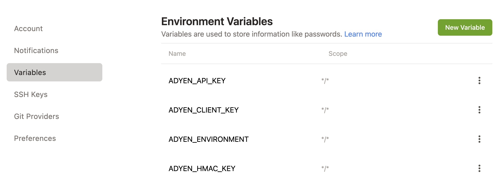

# Getting started with Gitpod

Gitpod is an open-source developer platform which runs your developer environment workspace in your browser.
We've set up `gitpod.yml`-files in each of our integration-examples that allows you to spin-up any repository with **one button click**.

## First-time users

Are you running the Adyen sample applications on Gitpod for the first time? Follow the steps below, you'll only need to do this once.

1. Make sure you have an [Adyen Test Account](https://ca-test.adyen.com/ca/ca/overview/default.shtml) and create the [API keys](https://docs.adyen.com/user-management/how-to-get-the-api-key)
2. Go to [gitpod environment variables](https://gitpod.io/user/variables)
3. Set the `ADYEN_API_KEY`, `ADYEN_CLIENT_KEY`, `ADYEN_HMAC_KEY` and `ADYEN_MERCHANT_ACCOUNT` environment variables (see below)
    - In the [React sample app](https://github.com/adyen-examples/adyen-react-online-payments), the `ADYEN_CLIENT_KEY` should be `REACT_ADYEN_CLIENT_KEY` instead
    - In the In-person Payments example, please include the terminal `ADYEN_POS_POI_ID` as environment variable
4. Add `https://*.gitpod.io` as allowed origin in the Customer Area using your [API Credentials](https://ca-test.adyen.com/ca/ca/config/api_credentials_new.shtml) to make sure the UI can load the Drop-in and Components
5. The URL of the running application on Gitpod should look like: `https://8080-myorg-myrepo-y8ad7pso0w5.ws-eu75.gitpod.io/api/webhooks/notifications/` - *Notice the port-number at the beginning of the URL*

> **Warning**: In a production environment, use the full fixed URL in your application instead of the asterisk `*`!




## Update environment variables

Do you need to update the HMAC key or another environment variable and s your application already running in Gitpod?

1. In the Gitpod terminal, stop the application (`Ctrl + C`)
2. Set the environment variable in the terminal
```shell
gp env ADYEN_HMAC_KEY=ASDEW##############
```
3. Update the environment variables in the terminal
```shell
eval $(gp env -e)
```
4. Restart the application in the terminal (e.g. `dotnet run`, `./gradlew bootRun`, `npm run dev` etc.) or recreate the Gitpod workpace 


